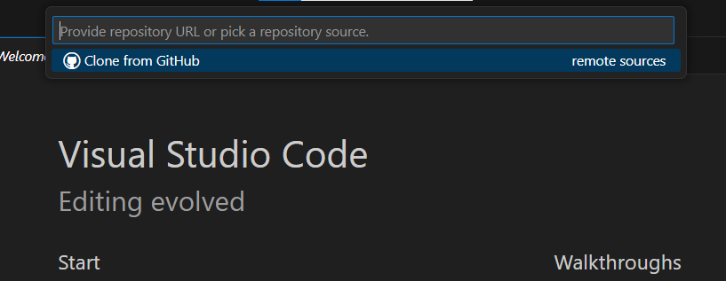

# ¿Qué es github?
Github es una plataforma creada por microsoft para alojar codigo de forma remota, su uso principal es llevar un control de versiones y cambios realizados en un proyecto.

En programación es recomendado utilizar un software de control de versiones para trabajar en equipo.

# Crear repositorio en github
Reconmendado:
* Visita [github.com](https://github.com)
* Haz click en tu foto de perfil y selecciona la opción repositorios (your repositories)
* Crea un nuevo repositorio dando click en el botón "new"

* Asigna un nombre a tu repositorio
* Escoge si tu repositorio sera publico o privado
* Añade un archivo README
* Añade una plantilla git ignore
* Por utlimo crea tu repositorio

# Clonar repositorio
* Abre Visual Studio Code y selecciona el icono mostrado
* Selecciona la opción clonar repositorio (Clone repository)

* En el menú desplegado selcciona clonar desde github (Clone from Github)

* Selecciona el repositrio que deseas clonar

* Elige donde guardar el repositorio

* Selecciona el botón azul para aceptar el acceso

* Cada vez que realices un cambio en el repositorio se mostraran en la interfaz
* Para subir un cambio has click en en boton +
* Añade un comentario en el campo de texto (dscripción de los cambios realizados)
* Confirma y envia los cambios
